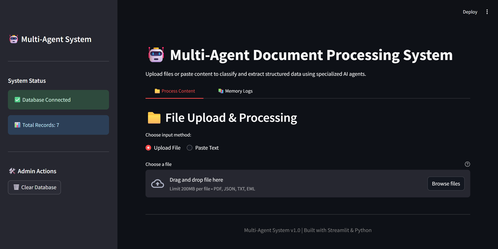
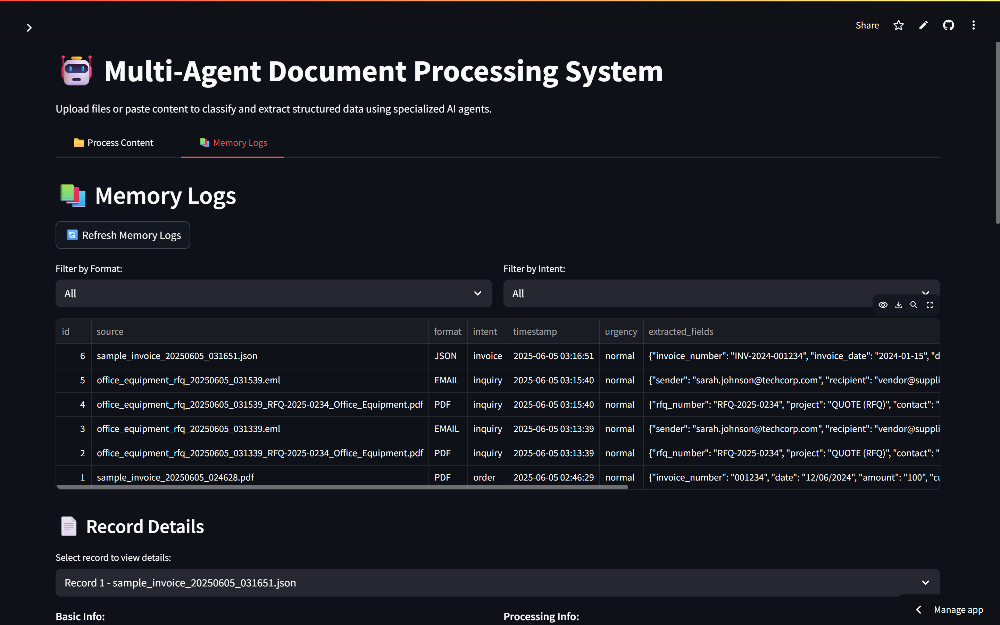

# Multi-Agent AI System

A comprehensive multi-agent system for processing and extracting structured data from various input formats (PDF, JSON, Email) using AI-powered classification and extraction. This system leverages specialized agents to handle different data types, enabling efficient, accurate, and scalable data processing workflows.

## 🖼️ UI Preview



## 🖼️ Memory Logs



## 🚀 Live Demo

**[View Live Site on Streamlit](https://itsmetilak-multi-agent-system-main-wy6bhh.streamlit.app/)**

## 🎯 System Overview

This system automatically:
- Accepts input in PDF, JSON, or Email formats
- Classifies file type and intent (e.g., RFQ, Invoice, Complaint)
- Routes input to specialized agents for targeted data extraction
- Maintains shared memory for traceability, audit trails, and chaining of data processing steps
- Provides a user-friendly Streamlit interface for easy interaction and monitoring

## 🏗️ Architecture

### Agent Types
1. **Classifier Agent**: Uses large language models (LLMs) to detect input format and classify intent, directing data to the appropriate processing agent.
2. **Email Agent**: Extracts sender information, urgency, intent, and relevant content from plain text or HTML emails.
3. **JSON Agent**: Validates JSON schema compliance and extracts relevant fields for downstream processing.
4. **PDF Agent**: Parses PDF documents to extract key information such as invoice details, complaints, reports, and RFQs.

### Shared Memory
- Implemented using an SQLite database for persistent and reliable storage.
- Tracks processing metadata, agent interactions, extracted data, and error states.
- Enables audit trails and supports chaining of agent outputs for complex workflows.

## 🚀 Quick Start

### Prerequisites
- Python 3.10+
- VS Code (recommended)
- OpenRouter API key (for LLM integration)

### Installation

1. **Clone and navigate to the project:**
```bash
cd multi_agent_system
```

2. **Create virtual environment:**
```bash
python -m venv venv
source venv/bin/activate  # On Windows: venv\Scripts\activate
```

3. **Install dependencies:**
```bash
pip install -r requirements.txt
```

4. **Set up environment variables:**
```bash
cp .env.example .env
# Edit .env with your API keys and configuration
```

5. **Initialize database:**
```bash
python -c "from memory.database import DatabaseManager; DatabaseManager().initialize_db()"
```

### Running the System

#### Option 1: Streamlit UI (Recommended)
```bash
streamlit run ui/streamlit_app.py
```
Access the web interface at `http://localhost:8501`

#### Option 2: Command Line
```bash
python main.py --file path/to/your/file --format email
```

## 📁 Project Structure

```
multi_agent_system/
├── main.py                    # Entry point script
├── requirements.txt           # Python dependencies
├── config.py                  # Configuration settings
├── .env.example              # Environment variables template
├── agents/                    # AI agents for processing
│   ├── base_agent.py         # Base agent class
│   ├── classifier_agent.py   # File classification
│   ├── email_agent.py        # Email processing
│   ├── json_agent.py         # JSON validation
│   └── pdf_agent.py          # PDF extraction
├── memory/                    # Shared memory system
│   ├── database.py           # SQLite operations
│   └── models.py             # Database schemas
├── ui/                        # User interface
│   └── streamlit_app.py      # Web interface
├── utils/                     # Utility modules
│   ├── file_handler.py       # File management
│   └── llm_client.py         # LLM integration
├── uploads/                   # File upload directory
├── data/                      # Database storage
└── tests/                     # Test files and samples
```

## 🔧 Configuration

### Environment Variables
Create a `.env` file with:

```env
# LLM Configuration
LLM_MODEL_NAME=meta-llama/llama-4-maverick:free
LLM_API_BASE=https://openrouter.ai/api/v1
LLM_API_KEY=your_api_key_here
LLM_TEMPERATURE=0.1
LLM_MAX_TOKENS=2048
LLM_TIMEOUT=30

# Database
DATABASE_PATH=data/database.db

# File Upload
MAX_FILE_SIZE=10
UPLOAD_DIR=uploads
```

### Supported Formats
- **PDF**: Invoices, complaints, reports, RFQs
- **JSON**: Structured data, API responses, configurations
- **Email**: Plain text, HTML emails (as .txt files)

## 🎮 Usage Examples

### Web Interface
1. Launch Streamlit app
2. Upload file or paste email content
3. View classification results
4. Examine extracted data
5. Browse processing history

### Command Line
```bash
# Process an email
python main.py --file tests/sample_email.txt --format email

# Process a PDF
python main.py --file tests/sample_complaint.pdf --format pdf

# Process JSON
python main.py --file tests/sample_invoice.json --format json
```

## 🧪 Testing

Run tests with sample files:
```bash
python -m pytest tests/
```

Or test individual components:
```bash
python tests/test_agents.py
```

## 📊 Database Schema

The system tracks:
- Processing metadata (ID, timestamp, format)
- Intent classification and confidence scores
- Extracted fields and agent assignments
- Error handling and status tracking
- Thread IDs for grouped interactions

## 🔍 Troubleshooting

### Common Issues

**API Errors:**
- Verify that your API key is valid and has not expired
- Ensure your internet connection is stable
- Monitor API usage limits and available credits

**File Upload Problems:**
- Confirm that uploaded files do not exceed the maximum size limit (default 10MB)
- Make sure the file format is supported (PDF, JSON, Email)
- Check that the application has the necessary permissions to read uploaded files

**Database Issues:**
- Initialize the database if it has not been set up
- Verify write permissions for the `data/` directory
- Ensure SQLite is properly installed and accessible

### Debug Mode
Enable detailed logging:
```bash
export LOG_LEVEL=DEBUG
python main.py --debug
```

## 🔒 Security Considerations

- API keys stored in environment variables
- File uploads restricted by size and type
- SQLite database uses parameterized queries
- Uploaded files automatically cleaned after processing

## 🚀 Extending the System

### Adding New Agents
1. Inherit from `BaseAgent` class
2. Implement required methods
3. Register in classifier routing
4. Update database schema if needed

### Custom LLM Integration
1. Modify `llm_client.py`
2. Update configuration in `config.py`
3. Adjust prompt templates in agents

## 📈 Performance Tips

- Use fallback rule-based logic for offline support
- Implement caching for frequent classifications
- Batch process multiple files
- Monitor API usage and costs

## 🤝 Contributing

1. Fork the repository
2. Create feature branch
3. Add tests for new functionality
4. Submit pull request


## 🆘 Support

For issues and questions:
- Check troubleshooting section
- Review test files for examples
- Open GitHub issues for bugs
- Contact maintainers for feature requests
